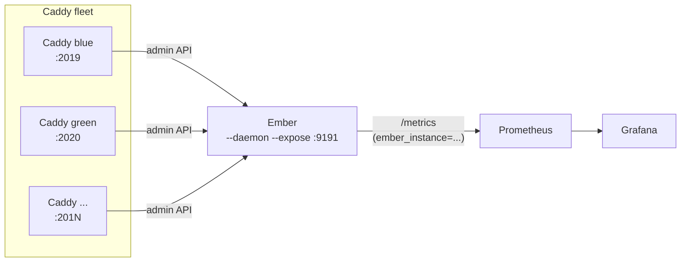

# Multi-instance monitoring

A single Ember process can scrape several Caddy instances at once and aggregate their metrics behind one `/metrics` endpoint. This page is the end-to-end tutorial: architecture, copy-paste walk-through, scrape config, a Grafana panel, the pitfalls that bite, and the recommended Kubernetes pattern.

For the reference flag syntax see [CLI Reference: Multi-instance monitoring](cli-reference.md#multi-instance-monitoring). For the resulting metric labels see [Prometheus Export: Multi-instance label](prometheus-export.md#multi-instance-label).

## When to use it

- One Prometheus endpoint covering a fleet of small Caddy services
- One TLS context to reload, one `/healthz` to alert on
- Per-instance polling cadence and TLS material when instances are heterogeneous

If you run Ember as a sidecar next to a single Caddy, you do **not** need this: stick with one `--addr`. Multi-instance mode is the fan-in case.

## Architecture



One Ember process, N Caddy instances, one Prometheus target. Every emitted metric (except `ember_build_info`) carries an `ember_instance="<name>"` label so PromQL can split or aggregate per instance.

## Walk-through

The repo ships a runnable two-Caddy stack at [`local/multi-caddy/`](../local/multi-caddy/) (`Caddyfile.blue`, `Caddyfile.green`, `compose.yaml`, `Makefile`).

```bash
cd local/multi-caddy
make up         # starts caddy-blue on :2019 and caddy-green on :2020
make ember      # in another terminal: ember --daemon --expose :9191 --addr blue=... --addr green=...
make traffic    # generate a bit of load against both
```

Then scrape Ember:

```bash
curl -s http://localhost:9191/metrics | grep ember_host_rps
```

```
ember_host_rps{host="localhost",ember_instance="blue"} 1.2
ember_host_rps{host="localhost",ember_instance="green"} 0.8
```

The same applies to every other metric: `frankenphp_threads_total`, `frankenphp_request_duration_milliseconds`, `ember_scrape_total`, etc. Tear the stack down with `make down`.

## Prometheus scrape config

```yaml
scrape_configs:
  - job_name: ember
    scrape_interval: 5s
    static_configs:
      - targets: ["ember:9191"]
    metric_relabel_configs:
      - source_labels: [ember_instance]
        target_label: instance
        action: replace
```

The `metric_relabel_configs` block promotes `ember_instance` to the standard `instance` label so PromQL filters feel natural (`{instance="blue"}`). The original `ember_instance` label is left in place: pick whichever you prefer in your queries.

`ember_build_info` is intentionally not relabelled because it carries no `ember_instance` to begin with: there is one Ember binary regardless of how many Caddy instances it polls.

## Grafana panel

Drop this panel JSON into a dashboard via *Add panel : Import via JSON* to chart RPS by instance:

```json
{
  "type": "timeseries",
  "title": "RPS by instance",
  "targets": [
    {
      "expr": "sum by (ember_instance) (ember_host_rps)",
      "legendFormat": "{{ember_instance}}"
    }
  ]
}
```

The same template works for any per-instance breakdown: replace the metric (`frankenphp_threads_total`, `ember_scrape_total{stage="metrics"}`, ...) and keep `sum by (ember_instance)`.

## Common pitfalls

### Name collisions

Two addresses that slugify to the same name are rejected at startup with an explicit `duplicate instance name` error. Fix it with explicit aliases:

```bash
ember --daemon --expose :9191 \
  --addr blue=http://10.0.0.10:2019 \
  --addr green=http://10.0.0.11:2019
```

### IPv4 hosts require an alias

Instance names must match `[a-zA-Z_][a-zA-Z0-9_]*` (Prometheus label rules: letters, digits and underscores only, not starting with a digit). A host like `192.168.1.10:2019` slugifies to `192_168_1_10_2019`, which starts with a digit, and is rejected when `--addr` is passed more than once. Same fix: use a `name=url` alias.

### Sharing TLS material

Each `--addr` carries its own TLS suffixes (`,ca=`, `,cert=`, `,key=`, `,insecure`). Anything omitted falls back to the corresponding global flag. To share a single CA across the fleet, set `--ca-cert` once and skip the per-instance suffix; override only the instance that needs it:

```bash
ember --daemon --expose :9191 --ca-cert /etc/ca/shared.pem \
  --addr web1=https://web1.fr \
  --addr web2=https://web2.fr,ca=/etc/ca/web2-private.pem
```

On `SIGHUP`, each instance re-reads its own certificate files independently.

### `EMBER_ADDR` separator is `;`, not `,`

When packing several addresses into the env var, use `;` between entries because the comma is reserved for TLS and interval suffixes:

```
EMBER_ADDR=web1=https://a,ca=/p/ca1.pem;web2=https://b,insecure
```

### Plugins must opt in

Plugins are skipped in multi-instance mode unless they implement [`plugin.MultiInstancePlugin`](plugins.md#multi-instance-plugins). A startup warning lists every disabled plugin so you can either remove the binary or update it to opt in.

## Kubernetes

### Sidecar (default choice)

Run Ember as a sidecar next to Caddy in the same Pod. This is the canonical pattern: each Pod has its own Ember, Prometheus discovers the `metrics` port via standard Pod scraping, and the `pod` label distinguishes replicas. Multi-instance mode is **not** needed here since each Ember sees one Caddy.

```yaml
apiVersion: apps/v1
kind: Deployment
metadata:
  name: caddy
spec:
  replicas: 2
  selector:
    matchLabels:
      app: caddy
  template:
    metadata:
      labels:
        app: caddy
      annotations:
        prometheus.io/scrape: "true"
        prometheus.io/port: "9191"
        prometheus.io/path: "/metrics"
    spec:
      containers:
        - name: caddy
          image: caddy:latest
          ports:
            - { containerPort: 80, name: http }
            - { containerPort: 2019, name: admin }
          volumeMounts:
            - { name: caddy-config, mountPath: /etc/caddy }
        - name: ember
          image: alexandredaubois/ember
          args: ["--daemon", "--expose", ":9191", "--addr", "http://localhost:2019"]
          ports:
            - { containerPort: 9191, name: metrics }
          readinessProbe:
            httpGet: { path: /healthz, port: metrics }
            periodSeconds: 5
      volumes:
        - name: caddy-config
          configMap: { name: caddy-config }
```

### Dedicated Deployment (fan-in)

Run a single Ember Deployment that scrapes several Caddy Services by name. Use this when Caddy instances are heterogeneous (different roles, different TLS, different cadences) and you want one aggregated `/metrics` view across the fleet. The Ember Pod's args become `--addr blue=http://caddy-blue:2019 --addr green=http://caddy-green:2019` (or the equivalent `EMBER_ADDR` env var with `;` separators), and every metric gains an `ember_instance` label.

Trade-off: one process to scale and observe, at the cost of a single point of failure on the metrics path. Prefer the sidecar pattern unless you specifically need fan-in: lab and staging clusters, small fleets, or aggregating remote clusters into a central observability stack.

## See Also

- [CLI Reference: Multi-instance monitoring](cli-reference.md#multi-instance-monitoring)
- [Prometheus Export: Multi-instance label](prometheus-export.md#multi-instance-label)
- [Plugins: Multi-instance plugins](plugins.md#multi-instance-plugins)
- [Docker: Multi-instance sidecar](docker.md#multi-instance-sidecar)
